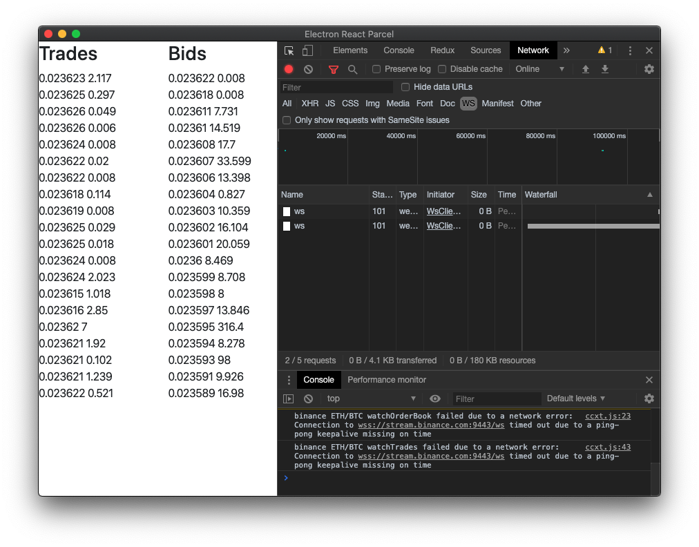

# Missing Ping-pong Keepalive Problem

## Description

After the app runs for 2-3 minutes, the network error will occur, creating a new websocket connection in the process without destroying the previous one, as shown in Devtool's Network tab.

> Connection to wss://stream.binance.com:9443/ws timed out due to a ping-pong keepalive missing on time

App uses only 1 exchange (binance), 1 symbol (ETH/BTC), with one `watchOrderbook` and one `watchTrades` running in parallel.

The order book updates can also be visually observed to slow down significantly as the number of duplicate websocket connections increases.

## To reproduce:

`yarn && yarn start`

*Distributing this minimal reproducible example in Electron ensures that we are using the same versions of Node and Chromium.*